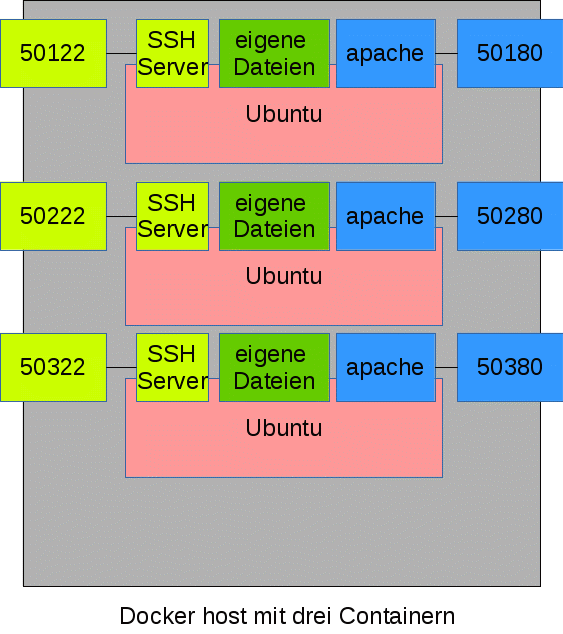

Mit Hilfe einer docker-Installation können Klassenarbeiten durchgeführt werden.

Container bauen
===============

Das Image wird mit Hilfe des Skrips `docker.exam-build.sh` gebaut: 

    ./docker.exam-build.sh

Grundlage für das Image ist die Datei `Dockerfile` im selben Ordner. 

Die Datei `docker-entrypoint.sh` wird in den Container kopiert und ausgeführt. Sie startet Dienste wie ssh oder den Apache-Webserver und wartet anschließend.

Container starten
=================

Eine beliebige Anzahl Container kann wie folgt gestartet werden.

    ./docker.exam-run.py ANZAHL
   
Der folgende Befehl startet z.B. 20 Container die nach folgendem Schma benannt werden: `exam1, exam2, ..., exam20`.

    ./docker.exam-run.py 20

Die Container sind über den Port 5XX22 per ssh erreichbar. Ein Webserver läuft auf Port 5XX80. Das `XX` muss durch die Nummer des Containers ersetzt werden: 50122 für den ersten, 50222 für zweiten, ... 52022 für den 20. Container.

Konfiguration des Startvorgangs
-------------------------------

Die Standardports und Bezeichnungen der Container können über Umgebungsvariablen geändert werden. Ein Aufruf von `docker.exam-run.py` ohne Parameter zeigt die möglichen Variablen.

Programme in allen Containern ausführen
=======================================

Ein beliebiges Programm kann in allen laufenden Container ausgeführt werden:

    ./docker.exam-exec.sh CMD
  
Um etwa alle auf dem jeweiligen Container eingeloggten User ausgeben zu lassen, reicht folgender Befehl:

    ./docker.exam-exec.sh who
